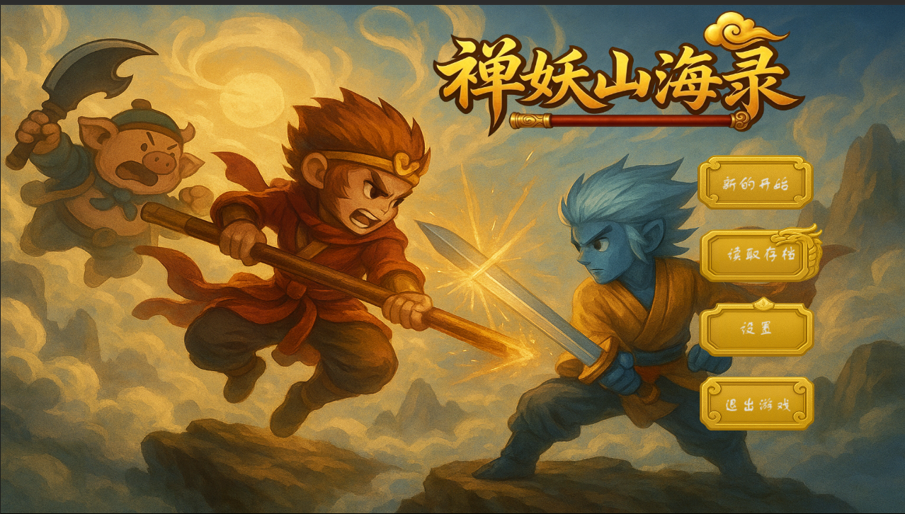
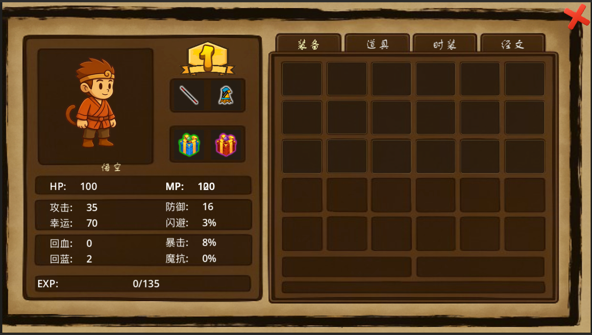
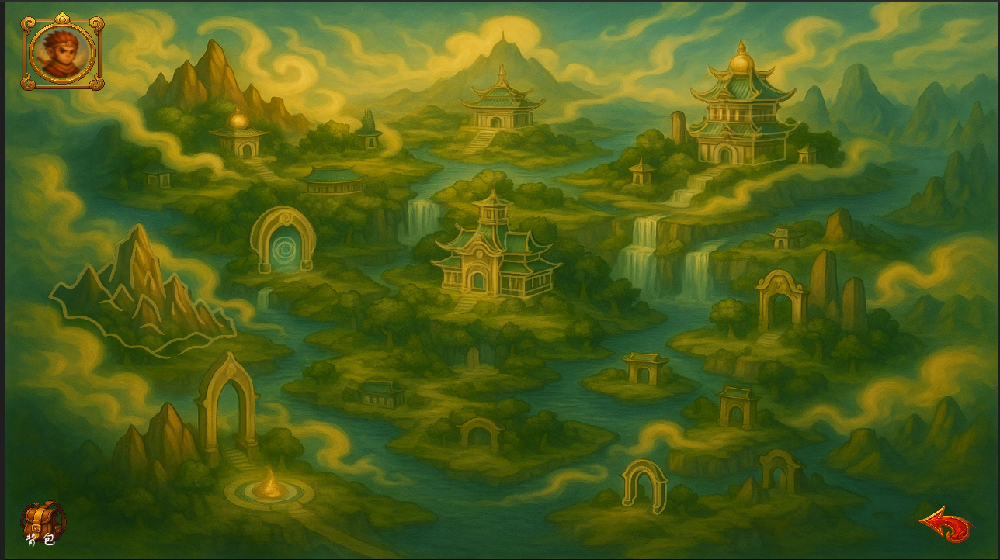

# 禅妖山海行

以山海经与西游意象为灵感的 **2D 横版动作 RPG**。  
客户端使用 **Godot 4.7**，存档 / 账号等后端使用 **Go + Gin**。

## 截图

### 首页



### 背包



### 地图



## 特性概览

- 角色选择与多存档（登录 / 注册 / 云端进度）
- 神霄世界地图选关：天门试炼、云台灵阵、玉阙擎天台等
- 波次战斗、镜头边界与清关结算
- 背包与装备面板（属性、分页道具）
- 角色成长：等级提升血量、蓝量、攻击、防御与经验需求

## 技术栈

<p align="center">
  
  &nbsp;&nbsp;
  
  &nbsp;&nbsp;
  
  &nbsp;&nbsp;
  
  &nbsp;&nbsp;
  
  &nbsp;&nbsp;
  
</p>

| Icon | 技术 | 用途 |
|:----:|:-----|:-----|
|  | **Godot 4.7** / GDScript | 游戏客户端、关卡、UI、战斗 |
|  | **GL Compatibility** | 渲染后端 |
|  | **Go 1.25+** | 后端服务 |
|  | **Gin** | HTTP API |
|  | **GORM** | ORM |
|  | **SQLite** | 数据持久化 |
|  | **`.env`** | `API_BASE` 等客户端配置 |

## 目录结构

```text
├── scenes/          # 菜单、关卡、UI 场景
├── scripts/         # 关卡逻辑、系统、UI 脚本
├── characters/      # 玩家与敌人
├── assets/          # 贴图、音频、TileSet 等
├── server/          # Go 后端
├── docs/            # README 截图与图标
└── project.godot
```

## 快速开始

### 1. 启动后端

```bash
cd server
go run ./cmd/server
```

默认监听 `http://localhost:8080`。

### 2. 配置客户端

```bash
cp .env.example .env
# API_BASE=http://localhost:8080
```

### 3. 运行 Godot

用 **Godot 4.7** 打开仓库根目录的 `project.godot`，运行主场景 `scenes/MainMenu.tscn`。

## 开发说明

- 全局单例：`scripts/systems/Global.gd`（API、存档进度、关卡结算草稿）
- 神霄关卡运行时：`scripts/levels/shenxiao/level_runtime_helper.gd`（刷角色、波次、出口）
- TileMap 重建脚本（可选）：`tools/patch_shenxiao_tilemaps.py`

## License

本项目以 [GNU GPL v3](LICENSE) 授权。
